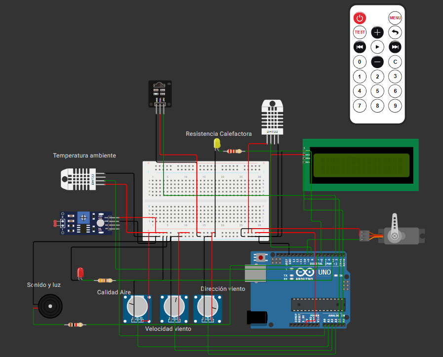

# 🌦️ Sistema de Control y Actuación Climática con Supervisión Inteligente y Control Remoto IR

Este proyecto implementa una **boya climática automatizada con Arduino**, diseñada para **medir, controlar y presentar condiciones meteorológicas clave**, con capacidades **remotas, inteligentes y de autodiagnóstico**.

-----

## 🧠 Objetivos del sistema

El sistema está orientado a:

- **Medir** condiciones ambientales clave:
  - Temperatura y humedad ambiental
  - Temperatura de batería
  - Iluminación ambiente
  - Calidad del aire
  - Velocidad y dirección del viento
- **Controlar automáticamente**:
  - **Calefactor** para proteger la batería contra temperaturas bajas
  - **Servomotor** para abrir compuerta si la batería se sobrecalienta
- **Presentar información** en una pantalla LCD de forma cíclica
- **Supervisar** el estado térmico con lógica difusa (fuzzy logic)
- **Permitir control remoto** mediante un **mando infrarrojo IR**
- **Detectar errores del sistema** a través de funciones básicas de **autodiagnóstico**

-----

## 🧰 Hardware

-----

### 🔌 Diagrama de Conexiones

-----

### 📦 Lista de materiales (BOM)

| Componente            | Cant. | Descripción                                         |
|----------------------|-------|-----------------------------------------------------|
| Arduino UNO           | 1     | Microcontrolador principal                          |
| DHT22                 | 2     | Sensor de temperatura y humedad (ambiente y batería)|
| LDR                   | 1     | Sensor de luz                                       |
| Sensor analógico      | 2     | Simulación de calidad de aire y viento              |
| Servo motor SG90      | 1     | Compuerta de ventilación                            |
| Buzzer                | 1     | Señal sonora nocturna                               |
| LED                   | 1     | Luz de señalización nocturna                        |
| Pantalla LCD I2C 16x2 | 1     | Visualización de datos                              |
| Receptor IR (KY-022)  | 1     | Comunicación infrarroja                             |
| Mando a distancia IR  | 1     | Control remoto (tipo Elegoo o similar)              |
| Resistencias          | Varios| Pull-up / divisores de tensión                      |
| Protoboard + cables   | -     | Conexionado general                                 |

-----

## 💻 Firmware

-----

### 🔧 Funcionalidades destacadas

- **🔥 Control de calefactor (zona muerta):**
  - Se activa cuando `T_bat < setpoint - zona_muerta`
  - Se desactiva cuando `T_bat > setpoint + zona_muerta`

- **🌬️ Compuerta de aire (servo):**
  - Se abre automáticamente si la batería supera los `40°C`

- **🌃 Modo nocturno inteligente:**
  - Se activa LED y buzzer si el nivel de luz cae por debajo del 70%

- **📺 Interfaz HMI local (LCD):**
  - Muestra cíclicamente todas las variables medidas y estado del sistema

- **🧪 Debug serie:**
  - Monitorización en tiempo real vía USB de todos los valores del sistema

- **📡 Control remoto IR:**
  - Mando a distancia permite modificar el `TEMP_SETPOINT` con botones `+` y `−`

- **🛠️ Autodiagnóstico:**
  - Verificación de rangos válidos de sensores
  - Comparación entre sensores para detectar diferencias anómalas

- **🤖 Supervisión inteligente:**
  - El sistema reajusta automáticamente el `setpoint` si detecta un gradiente excesivo entre temperatura ambiente y batería

- **🌀 Control Fuzzy (base demostrativa):**
  - Se calcula una señal de control difusa (no vinculante) como demostración de técnicas avanzadas de instrumentación

-----

### 📂 Código fuente

Consulta el archivo [`LAB_2.ino`](./LAB_2.ino) para acceder al código completo, organizado y comentado.

-----

## ✅ Pruebas de Validación

| Requisito                                                            | Estado |
|----------------------------------------------------------------------|--------|
| Medición ambiental completa                                          | ✅     |
| Control calefactor con zona muerta                                   | ✅     |
| Control servo si `T_bat > 40°C`                                      | ✅     |
| Control nocturno con buzzer y LED                                    | ✅     |
| Visualización en LCD                                                 | ✅     |
| Control remoto IR funcional                                          | ✅     |
| Supervisión inteligente (ajuste automático del setpoint)             | ✅     |
| Autodiagnóstico básico (rangos, diferencias)                         | ✅     |
| Base de control fuzzy para documentación e informe                   | ✅     |
| Simulación completa en Wokwi                                         | ✅     |

-----

## 🔗 Simulación en Wokwi

Accede directamente a la simulación funcional en Wokwi para probar todo el sistema:

👉 [**Simulación en Wokwi**](https://wokwi.com/projects/430770980504890369)

-----
